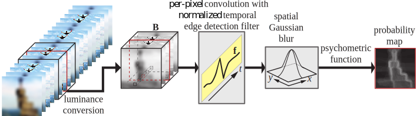

# flicker_metric_ted
[](https://opensource.org/licenses/MIT)
[](pipeline.svg)

Flicker predictor reference implementation accompanying the paper _Estimates of Temporal Edge Detection Filters in Human Vision_ (accepted to ACM Transactions on Applied Perception). 

In this example, the edge detection model is applied to a video of alternating frames with the aim to detect flicker across consecutive frames. The video cube is sampled at double the display refresh rate, and is convolved with a sampled temporal edge detection filter alongside the time axis. Values in the output that would require values from outside the time domain range are omitted.
To avoid scaling issues introduced by the changing refresh rates and the discrete convolution, we first normalize the edge detection filter such that all positive samples sum to $1$, and all negative samples sum to $-1$. The filter response varies along the time dimension, and we take the maximum value for each pixel along the time axis to get the largest response perceived during the second. These values are blurred as per Denes and Mantiuk 2020 before feeding them through a psychometric function to yield a probability of detection map.

## Usage
The model is self-contained in this repository. The single entry point is `predict_flicker_in_image.m` which takes two consecutive frames, a display resolution (ppd) and a refresh rate. Frames should be in CIE XYZ. The model could be trivially extended to cope with an arbitrary video cube.

## Examples
For example usage, please see the `demo` folder.

## Python implementation
There is a Python reference implementation available in [reference_impl_py.ipynb](reference_impl_py.ipynb). This is a translation of the original Matlab code, and is expected to yield similar answers to the original Matlab implementation. The results in the paper are based on Matlab.


## Dataset
This flicker stimuli dataset is reproduced from https://github.com/gdenes355/flicker_metric_hvei. Details on its collection can be found in the original paper (pre-print: https://www.cl.cam.ac.uk/~gd355/publications/hvei20_paper_comp.pdf). For completeness, we reproduce the dataset description here as well.

You can evaluate your own flicker model against our dataset if you would like to. The entire dataset is uploaded and can be found in `stimuli.mat`. Use Matlab (scipi.io.loadmat from Python) to open this.
Fields:
* P: 18x512x512 array: aggregated marking probabilities for the 18 images
* P_observers: 18x19x512x512 array: marking probabilities for the 18 images for the 19 individual observers (averaged over 3 trials per observer)
* V_observers: 18x19x512x512 array: marking variance for the 18 images for the 19 individual observers (measured over 3 trials per observer)
* V_sample: 18x512x512 array: sample variance for the 18 image markings (measured as `var(P_observers, 1, 2) / 9`)
* V_simple: 18x512x512 array: variance estimated as pq
* names: 18x1 cell: image names
* levels: 18x1 array: blur levels
* refreshRates: 18x1 array: refresh rate at which the images were displayed (note that the flicker frequency of the alternating signal is half of the refresh rate -- see Nyquist)
* ref: 18x512x512x3 array: 18 sharp images encoded in CIE 1931 XYZ
* blur : 18x512x512x3 array: 18 blurry images encoded in CIE 1931 XYZ
Data was measured on 52ppd.

An example use of the stimuli would be:
```matlab
iS = 8;  % use the 8th stimulus
ppd = 52;
PMap = predict_flicker_in_image(squeeze(stimuli.ref(iS,:,:,:)), ...
                                squeeze(stimuli.blur(iS,:,:,:)), ...
                                ppd, stimuli.refreshRates(iS));
PMap = clamp(PMap, 0, 1);                           
GroundTruth = squeeze(stimuli.P(iS,:,:));
```

## References
_Accepted to ACM Transactions on Applied Perception_
[1] Pontus Ebelin, Gyorgy Denes, Tomas Akenine-Möller, Kalle Åström, Magnus Oskarsson, William H. McIlhagga "Estimates of Temporal Edge Detection Filters in Human Vision" , ACM Transactions on Applied Perception, 2024

If you found  the stimuli dataset useful, please also cite our previous work:

[2] Gyorgy Denes, Rafal K. Mantiuk "Predicting visible flicker in temporally changing images" in Human Vision and Electronic Imaging, 2020 https://doi.org/10.2352/ISSN.2470-1173.2020.11.HVEI-233

## License
MIT License

Copyright (c) 2022 Pontus Ebelin, Gyorgy Denes, Tomas Akenine-Möller, Kalle Åström, Magnus Oskarsson, William H. McIlhagga

Permission is hereby granted, free of charge, to any person obtaining a copy
of this software and associated documentation files (the "Software"), to deal
in the Software without restriction, including without limitation the rights
to use, copy, modify, merge, publish, distribute, sublicense, and/or sell
copies of the Software, and to permit persons to whom the Software is
furnished to do so, subject to the following conditions:

The above copyright notice and this permission notice shall be included in all
copies or substantial portions of the Software.

THE SOFTWARE IS PROVIDED "AS IS", WITHOUT WARRANTY OF ANY KIND, EXPRESS OR
IMPLIED, INCLUDING BUT NOT LIMITED TO THE WARRANTIES OF MERCHANTABILITY,
FITNESS FOR A PARTICULAR PURPOSE AND NONINFRINGEMENT. IN NO EVENT SHALL THE
AUTHORS OR COPYRIGHT HOLDERS BE LIABLE FOR ANY CLAIM, DAMAGES OR OTHER
LIABILITY, WHETHER IN AN ACTION OF CONTRACT, TORT OR OTHERWISE, ARISING FROM,
OUT OF OR IN CONNECTION WITH THE SOFTWARE OR THE USE OR OTHER DEALINGS IN THE
SOFTWARE.
